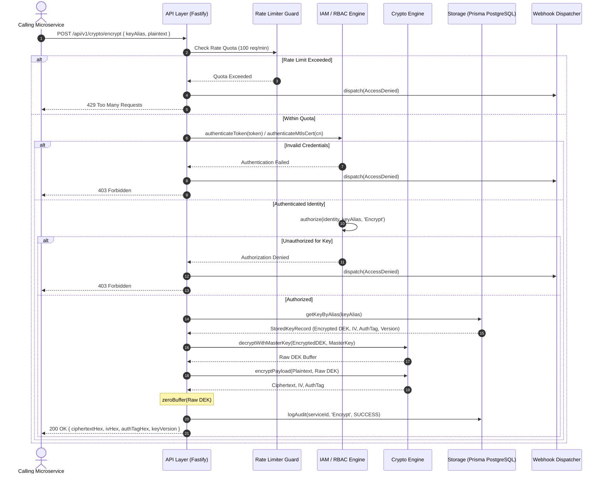

# Enclave System Architecture & Operational Specification

This document provides a principal-level architectural specification of the Enclave Key Management System (KMS) & Secret Enclave microservice.

---

## 1. Executive Summary & Core System Boundaries

Enclave is a hardened, zero-trust Key Management System (KMS) and cryptographic microservice built with Node.js, Fastify, TypeScript, and PostgreSQL. It isolates sensitive cryptographic operations and Data Encryption Keys (DEKs) away from application microservices.

```mermaid
graph TD
    subgraph Microservices / Callers
        AppA[Billing Microservice]
        AppB[Auth Microservice]
    end

    subgraph Enclave KMS Microservice (Port 8200)
        API[Fastify API Router / OpenAPI 3.0]
        RateLimiter[Rate Limiter Guard]
        IAM[Zero-Trust IAM & RBAC]
        Crypto[AES-256-GCM Crypto Engine]
        Rotator[Key Rotator Worker]
        Webhooks[Webhook Dispatcher]
        StorageAdapter[Storage Adapter Interface]
        PrismaAdapter[Prisma PostgreSQL Adapter]
        MemoryAdapter[In-Memory Adapter]
    end

    subgraph Persistent Storage
        DB[(PostgreSQL / Neon DB)]
    end

    AppA -->|Bearer Token / mTLS| API
    AppB -->|Bearer Token / mTLS| API
    API --> RateLimiter
    RateLimiter --> IAM
    IAM -->|Authorize| Crypto
    Crypto --> StorageAdapter
    Rotator -->|Scan & Rotate| StorageAdapter
    StorageAdapter --> PrismaAdapter
    StorageAdapter --> MemoryAdapter
    PrismaAdapter -->|Encrypted DEK Blobs| DB
    Crypto -->|Dispatched Events| Webhooks
```

---

## 2. Cryptographic Architecture & Envelope Encryption

### 2.1 Envelope Encryption Model

Enclave uses a two-tier envelope encryption model to guarantee high performance and strict key isolation:

1. **Master Key (KEK - Key Encryption Key)**:
   - A 256-bit (64 hex characters) root key injected at startup via `ENCLAVE_MASTER_KEY` or unsealed via Shamir Secret Sharing.
   - Supports domain prefix `enc_kek_` (e.g., `enc_kek_d6e0020a1769bba9...`).
   - Resides exclusively in server memory and is never written to disk or database storage.

2. **Data Encryption Key (DEK)**:
   - Unique 256-bit cryptographically secure random keys generated via `crypto.randomBytes(32)` per key alias.
   - Plaintext DEKs are used transiently to encrypt payload data and are immediately zeroed out in memory.
   - Encrypted DEKs are wrapped with the Master KEK using AES-256-GCM before being stored in the database.

```text
+-----------------------------------------------------------------------------------+
|                                 ENCLAVE SERVER                                    |
|                                                                                   |
|  +-----------------------+     AES-256-GCM Wrap      +-------------------------+  |
|  | Master Key (KEK 256b) | ------------------------> | Encrypted DEK Blob      |  |
|  +-----------------------+                           +-------------------------+  |
|              |                                                    |               |
+--------------|----------------------------------------------------|---------------+
               |                                                    v
               |                                           +------------------+
               |                                           | PostgreSQL DB    |
               |                                           | (key_meta table) |
               |                                           +------------------+
```

---

### 2.2 AES-256-GCM Parameters

All cryptographic operations enforce Galois/Counter Mode (GCM) for authenticated encryption:

| Parameter | Specification | Purpose |
|-----------|---------------|---------|
| **Algorithm** | `aes-256-gcm` | Provides both confidentiality and authenticated integrity |
| **Key Size** | 256 bits (32 bytes) | Cryptographic security standard |
| **IV (Initialization Vector)** | 96 bits (12 bytes) | Unique per-operation random nonce via `crypto.randomBytes(12)` |
| **Auth Tag Length** | 128 bits (16 bytes) | Authenticates ciphertext payload integrity against tampering |

---

### 2.3 Memory Scrubbing & Security Invariants

To prevent sensitive key material from being exposed via Node.js heap dumps or process inspection:

```typescript
// Explicit zero-fill memory scrubbing invariant
public static zeroBuffer(buf: Buffer): void {
  buf.fill(0);
}
```

- **Invariant 1**: Every raw DEK `Buffer` is passed to `zeroBuffer()` immediately after an encryption, decryption, or storage operation finishes.
- **Invariant 2**: Plaintext DEK material is **NEVER** logged, written to disk, or returned in standard API error tracebacks.

---

### 2.4 Domain Key Prefixing Schema (`enc_`)

Enclave enforces explicit domain key prefixing for secret scanning and resource type identification:

| Resource Type | Domain Prefix | Example Format |
|---------------|---------------|----------------|
| **Key Record ID** | `enc_key_` | `enc_key_5a791bcf-02b7-4ea1-9caf-e5c48acf63f0` |
| **Master KEK** | `enc_kek_` | `enc_kek_d6e0020a1769bba9b76a51ad7e1c8335...` |
| **Shamir Secret Share** | `enc_shr_` | `enc_shr_1_a7ed9c3442451e876a76d652...` |
| **Service Bearer Token** | `enc_tok_` | `enc_tok_billing_d45c7666b43677ce041892...` |

---

### 2.5 Shamir Secret Sharing (Multi-Operator Split Unseal)

For high-security deployments where a single operator must not hold the Master KEK:

- **Key Splitting**: The 256-bit Master Key is split into $N$ secret shares prefixed with `enc_shr_X_` using deterministic XOR threshold splitting (`ShamirUnsealEngine.splitMasterKey`).
- **Key Reconstruction**: $N$ operators present their individual shares to reconstruct the original Master Key in memory during bootstrap (`ShamirUnsealEngine.combineShares`).

---

## 3. End-to-End Request Lifecycle & Module Flow



---

## 4. Automated Background DEK Rotation Worker

The `KeyRotatorWorker` background service automatically enforces key expiration compliance:

- **Key Age Evaluation**: Periodically queries storage adapter for active DEK records exceeding `ENCLAVE_KEY_MAX_AGE_DAYS` (default: 90 days).
- **Automated Re-Wrapping**: Generates a new 256-bit DEK, wraps it with Master KEK, saves version $V+1$ to PostgreSQL, logs audit entry `AutoRotateKey`, and fires `RotateKey` webhook notification.

---

## 5. Real-Time Security Event Webhooks

When security events occur (`GenerateKey`, `RotateKey`, `RevokeKey`, `AccessDenied`), `WebhookDispatcher` asynchronously posts JSON payloads to target URLs configured in `ENCLAVE_WEBHOOK_URLS`:

```json
{
  "event": "RevokeKey",
  "timestamp": "2026-07-28T22:41:00.000Z",
  "serviceId": "billing-service",
  "keyAlias": "production-payment-key",
  "status": "SUCCESS",
  "ipAddress": "127.0.0.1"
}
```

- **HMAC Signature Header**: All webhooks include `X-Enclave-Signature: sha256=<hmac>` computed using `ENCLAVE_WEBHOOK_SECRET` for payload authenticity verification.

---

## 6. Zero-Trust IAM & RBAC Specification

### 6.1 Dual Authentication Drivers

1. **Bearer Token Authentication**: Pre-shared API keys supplied via `Authorization: Bearer enc_tok_...` and validated in constant time (`crypto.timingSafeEqual`).
2. **mTLS Certificate Authentication**: Validated against client certificate Subject CN headers in constant time.

---

## 7. Threat Vector Analysis & Security Invariants

| Threat Vector | Severity | Mitigation Strategy |
|---------------|----------|---------------------|
| **Side-Channel Timing Attacks** | Critical | All token and certificate comparisons use Node native `crypto.timingSafeEqual`. |
| **Heap Inspection / Process Dumps** | High | Plaintext DEK buffers are zero-filled (`buffer.fill(0)`) immediately after use. |
| **Database Compromise** | Critical | Database stores only encrypted DEK blobs wrapped via Master Key. Zero plaintext keys exist on disk. |
| **Brute-Force & Denial of Service** | High | `@fastify/rate-limit` enforces 100 req/min per-token quotas with HTTP 429 response. |
| **Secret Leaks** | High | Standardized `enc_` prefix schema enables automated GitHub/GitLab secret scanning detection. |
| **Key Theft & Unauthorized Access** | High | Strict IAM RBAC checks enforce key alias and operation permissions per service identity. |
