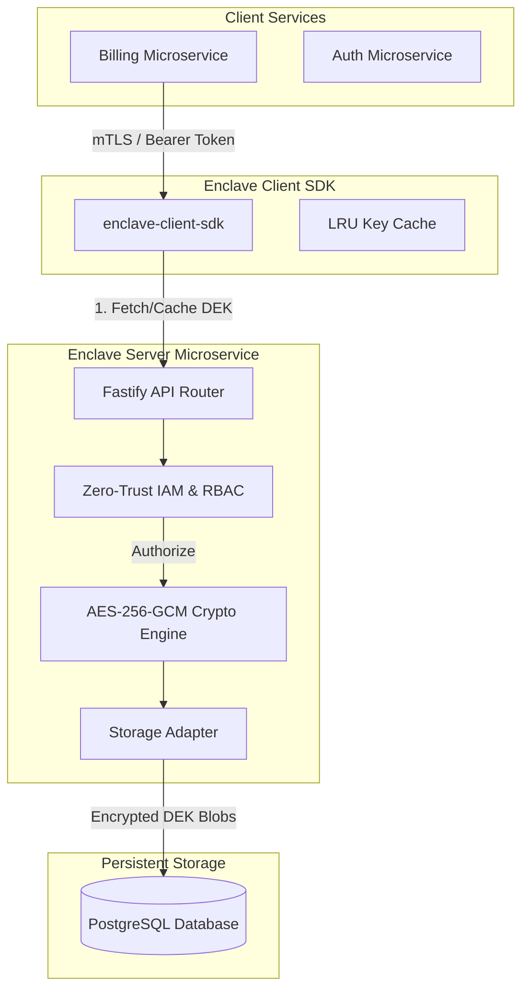
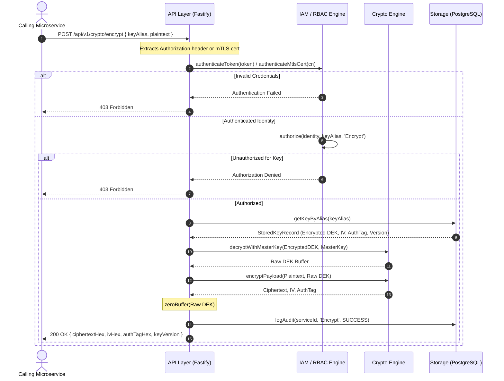

# Enclave System Architecture & Operational Specification

This document provides a principal-level architectural specification of the Enclave Key Management System (KMS) microservice and Client SDK.

---

## 1. Executive Summary & Core System Boundaries

Enclave is a hardened, zero-trust Key Management System (KMS) and cryptographic microservice built with Node.js, Fastify, TypeScript, and PostgreSQL. It isolates sensitive cryptographic operations and data encryption keys (DEKs) away from application microservices.



---

## 2. Cryptographic Architecture & Envelope Encryption

### 2.1 Envelope Encryption Model

Enclave uses a two-tier envelope encryption model to guarantee high performance and strict key isolation:

1. **Master Key (KEK - Key Encryption Key)**:
   - A 256-bit (64 hex characters) root key injected at startup via `ENCLAVE_MASTER_KEY` or unsealed via Shamir Secret Sharing.
   - Resides exclusively in server memory and is never written to disk or database storage.

2. **Data Encryption Key (DEK)**:
   - Unique 256-bit cryptographically secure random keys generated via `crypto.randomBytes(32)` per key alias.
   - Plaintext DEKs are used transiently to encrypt payload data and are immediately zeroed out in memory.
   - Encrypted DEKs are wrapped with the Master KEK using AES-256-GCM before being stored in the database.

```text
+-----------------------------------------------------------------------------------+
|                                 ENCLAVE SERVER                                    |
|                                                                                   |
|  +-----------------------+     AES-256-GCM Wrap      +-------------------------+  |
|  | Master Key (KEK 256b) | ------------------------> | Encrypted DEK Blob      |  |
|  +-----------------------+                           +-------------------------+  |
|              |                                                    |               |
+--------------|----------------------------------------------------|---------------+
               |                                                    v
               |                                           +------------------+
               |                                           | PostgreSQL DB    |
               |                                           | (key_meta table) |
               |                                           +------------------+
```

---

### 2.2 AES-256-GCM Parameters

All cryptographic operations enforce Galois/Counter Mode (GCM) for authenticated encryption:

| Parameter | Specification | Purpose |
|-----------|---------------|---------|
| **Algorithm** | `aes-256-gcm` | Provides both confidentiality and authenticated integrity |
| **Key Size** | 256 bits (32 bytes) | Cryptographic security standard |
| **IV (Initialization Vector)** | 96 bits (12 bytes) | Unique per-operation random nonce via `crypto.randomBytes(12)` |
| **Auth Tag Length** | 128 bits (16 bytes) | Authenticates ciphertext payload integrity against tampering |

---

### 2.3 Memory Scrubbing & Security Invariants

To prevent sensitive key material from being exposed via Node.js heap dumps or process inspection:

```typescript
// Explicit zero-fill memory scrubbing invariant
public static zeroBuffer(buf: Buffer): void {
  buf.fill(0);
}
```

- **Invariant 1**: Every raw DEK `Buffer` is passed to `zeroBuffer()` immediately after an encryption, decryption, or storage operation finishes.
- **Invariant 2**: Plaintext DEK material is **NEVER** logged, written to disk, or returned in standard API error tracebacks.

---

### 2.4 Shamir Secret Sharing (Multi-Operator Split Unseal)

For high-security deployments where a single operator must not hold the Master KEK:

- **Key Splitting**: The 256-bit Master Key is split into $N$ secret shares using deterministic XOR threshold splitting (`ShamirUnsealEngine.splitMasterKey`).
- **Key Reconstruction**: $N$ operators present their individual shares to reconstruct the original Master Key in memory during bootstrap (`ShamirUnsealEngine.combineShares`).

---

## 3. End-to-End Request Lifecycle & Module Flow



---

## 4. Zero-Trust IAM & RBAC Specification

### 4.1 Dual Authentication Drivers

Enclave supports two identity authentication mechanisms:

1. **Bearer Token Authentication**:
   - Clients supply pre-shared API keys via `Authorization: Bearer <token>`.
   - Validated against identity registry using constant-time comparison (`crypto.timingSafeEqual`).

2. **mTLS (Mutual TLS) Certificate Authentication**:
   - Reverse proxies or ingress controllers forward client certificate Common Name / SAN via `x-client-cert-cn` or `x-forwarded-client-cert` headers.
   - Validated against `clientCertCn` identity mappings in constant time.

---

### 4.2 Fine-Grained RBAC Permission Matrix

Every service identity specifies exact key aliases and operation scopes:

```json
[
  {
    "serviceId": "billing-service",
    "token": "billing-secret-token",
    "clientCertCn": "billing-service.internal",
    "allowedKeyAliases": ["billing-card-key"],
    "allowedOperations": ["Encrypt", "Decrypt", "GenerateKey", "RotateKey"]
  }
]
```

- **Operations**: `'Encrypt'`, `'Decrypt'`, `'GenerateKey'`, `'RotateKey'`, `'RevokeKey'`, `'GetKey'`, `'ExportAudit'`, `'*'`.
- **Key Aliases**: Explicit string array or wildcard `"*"` matching.

---

## 5. Storage Layer & Database Schema

Enclave uses Prisma ORM targeting PostgreSQL for persistent state:

```prisma
model KeyMeta {
  id                   String   @id @default(uuid())
  alias                String   @unique
  serviceOwner         String   @map("service_owner")
  encryptedKeyMaterial Bytes    @map("encrypted_key_material")
  iv                   Bytes
  authTag              Bytes    @map("auth_tag")
  version              Int      @default(1)
  state                KeyState @default(ENABLED)
  createdAt            DateTime @default(now()) @map("created_at")
  updatedAt            DateTime @updatedAt @map("updated_at")

  @@index([serviceOwner])
  @@map("key_meta")
}

model AuditLog {
  id        String   @id @default(uuid())
  timestamp DateTime @default(now())
  serviceId String   @map("service_id")
  action    String
  keyId     String?  @map("key_id")
  status    String
  ipAddress String?  @map("ip_address")

  @@index([serviceId])
  @@index([keyId])
  @@map("audit_logs")
}
```

---

## 6. Client SDK Architecture & Local Caching Strategy

The `enclave-client-sdk` package provides two encryption modes:

```text
                           +----------------------------+
                           |     enclave-client-sdk     |
                           +----------------------------+
                                  /              \
                                 /                \
            Local Caching Mode  /                  \  Remote Server Mode
                               /                    \
                              v                      v
                +-------------------+          +-------------------+
                | Local AES-256-GCM |          | Enclave HTTP API  |
                | Cryptography      |          | Remote Encryption |
                +-------------------+          +-------------------+
```

1. **Local Envelope Encryption Mode (Default)**:
   - SDK calls `/api/v1/keys/fetch` once to retrieve the DEK.
   - Caches DEK in an in-memory LRU cache (`KeyCache`) with configurable TTL (default: 5 mins).
   - Executes `AES-256-GCM` encryption/decryption locally inside client application memory at sub-millisecond speeds (>100,000 ops/sec).
   - Automatically wipes expired keys from LRU cache memory.

2. **Remote API Mode**:
   - SDK delegates raw plaintext and ciphertext payloads to the Enclave server via HTTP POST `/api/v1/crypto/encrypt`.

---

## 7. Threat Vector Analysis & Security Invariants

| Threat Vector | Severity | Mitigation Strategy |
|---------------|----------|---------------------|
| **Side-Channel Timing Attacks** | Critical | All token and certificate comparisons use Node native `crypto.timingSafeEqual`. |
| **Heap Inspection / Process Dumps** | High | Plaintext DEK buffers are zero-filled (`buffer.fill(0)`) immediately after use. |
| **Database Compromise** | Critical | Database stores only encrypted DEK blobs wrapped via Master Key. Zero plaintext keys exist on disk. |
| **Key Theft & Unauthorized Access** | High | Strict IAM RBAC checks enforce key alias and operation permissions per service identity. |
| **Tampered Ciphertext Payloads** | High | AES-256-GCM 128-bit authentication tags verify integrity; tampered payloads fail deciphering instantly. |
| **Cascading Key Compromise** | High | Individual key aliases can be independently rotated (`/rotate`) or revoked (`/revoke`). |
